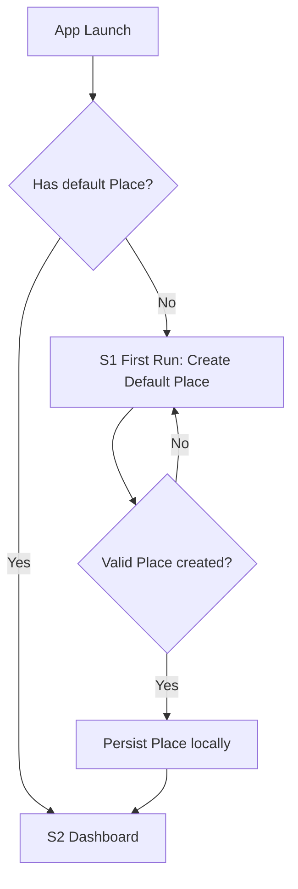
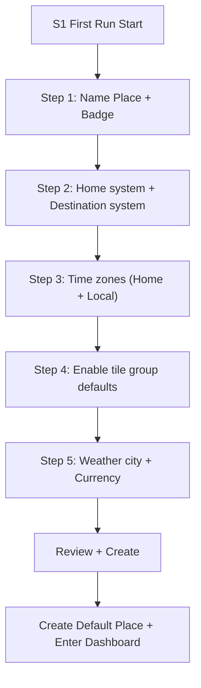
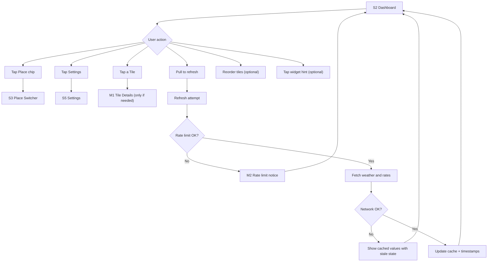
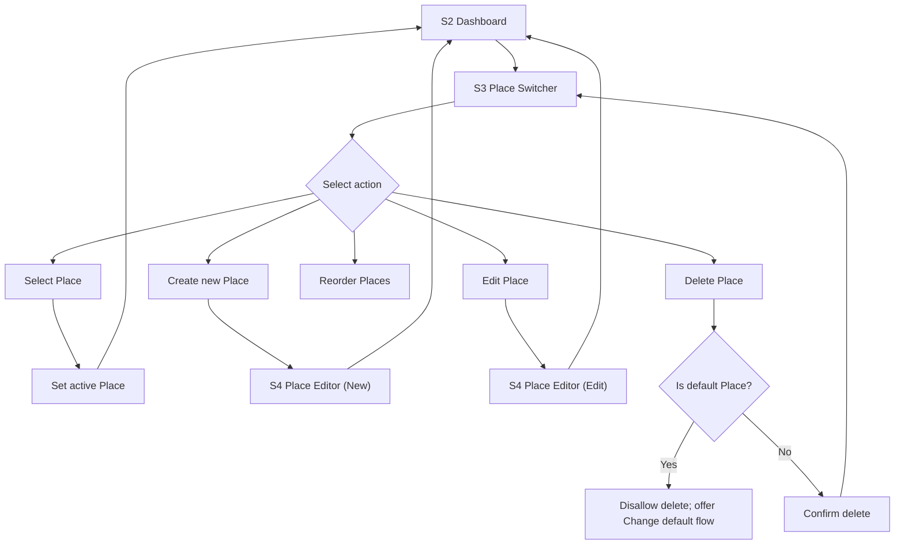
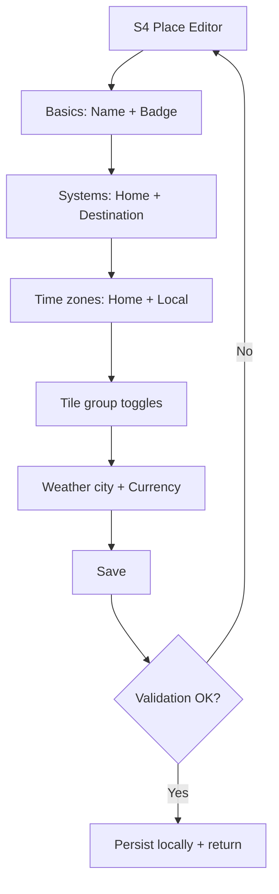
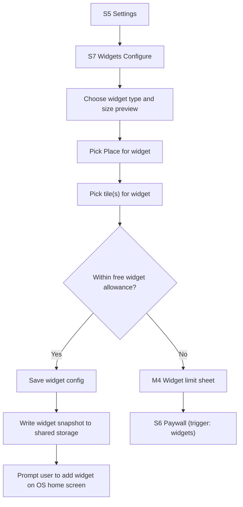
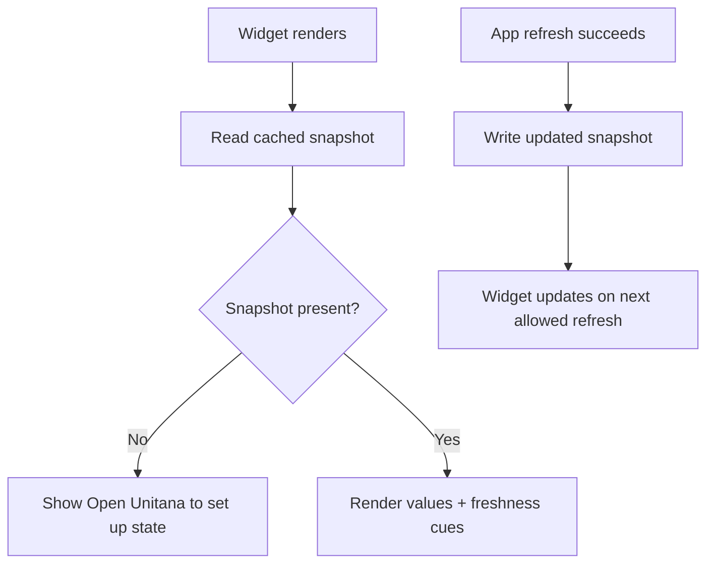
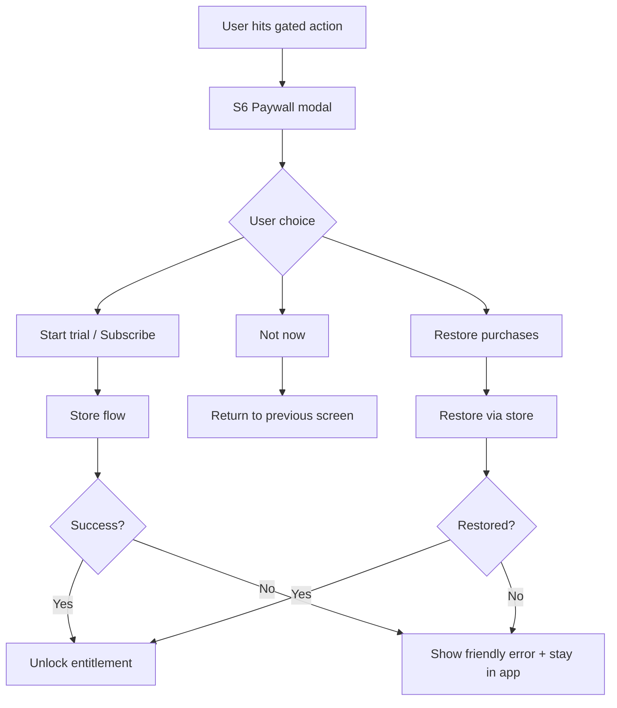

# Unitana — Flows and Navigation Map (MVP)
File: `docs/01-flows.md`

This document defines the MVP user flows and screen-to-screen navigation for Unitana. It is intentionally specific enough to implement, but still flexible enough for design iteration.

---

## 1) Scope and principles

### MVP scope covered here
- First-run setup (forced creation of exactly one default Place)
- Dashboard (the one-screen reason to open the app)
- Place switcher and Place editor
- Settings (learning mode, privacy, accessibility, subscription, widgets)
- Widgets (display-only) selection and configuration
- Subscription and gating triggers
- Refresh and offline behavior (weather and currency as cached data)
- Essential error and edge flows (stale cache, no network, invalid input)

### Core principles
- Calm dashboard, fast to value
- Offline-first and honest about freshness
- Learning aids guide, they do not lecture
- Accessibility day one

---

## 2) Defaults locked for MVP (answers applied)
These defaults are now considered part of the MVP navigation contract.

- **Weather location selection**: **City-based only** (no “use current location” in MVP).
- **Currency default for Visiting Places**: **Enabled by default**.
- **Primary paywall moment**: **Widgets** (first meaningful gating moment is when the user tries to add more than the free widget allowance).

Recommended starting gate (can change later without rewriting flows):
- Free tier includes **1 widget**.
- Paywall appears when user attempts to add a **2nd widget** (or exceeds the free allowance).
- Places gating remains available later (for example 4th Place), but is not the primary moment.

---

## 3) Glossary
- **Place**: A saved configuration that defines home system, destination system, enabled tile groups, time zones, and weather and currency context.
- **Tile**: A dashboard card for a single category (temperature, currency, time zones, etc.).
- **Learning mode**: Human or Neutral.
- **Fresh / Stale**: Cache freshness states shown in UI and widgets.
- **Widget config**: Which Place and which tile(s) a widget displays.

---

## 4) Screen inventory and route map

Naming convention: `S#` for screens, `M#` for modals/sheets.

### Screens (primary)
- **S0** App Launch / Routing (decides First Run vs Dashboard)
- **S1** First Run: Create Default Place (wizard)
- **S2** Dashboard (Place-aware)
- **S3** Place Switcher (sheet/modal)
- **S4** Place Editor (create/edit)
- **S5** Settings
- **S6** Subscription Paywall (modal)
- **S7** Widgets: Configure (in-app config + previews)
- **S8** Manage Subscription (handoff to store, plus explanation)

### Supporting views (lightweight)
- **M1** Tile Details (optional, only for tiles that need it)
- **M2** Refresh Status / Rate Limit Notice (toast/sheet)
- **M3** Stale Data Explanation (small sheet)
- **M4** Widget Limit Sheet (optional helper that leads into paywall)

### Suggested route IDs (for engineering)
- `/first-run`
- `/dashboard`
- `/places/switcher`
- `/places/edit?placeId=...` and `/places/new`
- `/settings`
- `/paywall?trigger=...`
- `/widgets`
- `/subscription/manage`

---

## 5) Global navigation model (MVP)

### Top-level navigation
- Default landing screen after setup: **Dashboard (S2)**
- Global controls on Dashboard:
  - **Place chip** (opens Place Switcher S3)
  - **Settings icon** (opens Settings S5)
- The Dashboard stays the home base; everything returns here.

### Back behavior (platform-friendly)
- iOS: back gestures and nav back where appropriate; modals dismiss downward.
- Android: system back closes sheets/modals first, then returns to Dashboard, then exits app.

---

## 6) Core flows (Mermaid)

### 6.1 App launch and first-run routing

Notes
- First run is not skippable. User must create exactly one default Place.
- “Living” is recommended, but user can pick Visiting or Other without friction.

---

### 6.2 First-run: Create Default Place (wizard)

Wizard step details
- Step 1: Name + badge/type (Living, Visiting, Other)
  - Helper copy: “You can create more Places later.”
- Step 2: Home system and destination system
  - Example: US customary vs Metric
- Step 3: Time zones
  - Default: Home + Local
- Step 4: Tile group defaults
  - Living: Weather, Time, Distance/Speed, Weight, Currency
  - Visiting: Weather, Time, Currency, Distance/Speed
  - Other: Minimal starter set
- Step 5: Context (locked defaults)
  - Weather location: **pick a city/region** (no current-location toggle in MVP)
  - Currency: choose base and local currencies
    - If badge is **Visiting**, currency is enabled by default

---

### 6.3 Dashboard flow (the home base)

Dashboard content states
- Fresh: normal display
- Stale but usable: subtle warning state, “tap for details”
- No data yet: empty state prompts user to configure weather/currency for the active Place

---

## 7) Place flows

### 7.1 Place switcher

Rules
- There is always exactly one default Place.
- Default Place cannot be deleted. It can be changed.

### 7.2 Place editor (create/edit)

---

## 8) Widgets flows (display-only MVP)

### 8.1 Configure widgets (in-app)
Widgets are configured inside the app (S7). Widgets then read from shared cached snapshots written by the app.

Widget config rules (MVP)
- Each widget points at one Place.
- Widget shows a curated subset of tiles suitable for its size.
- Widget never implies live data. It shows freshness cues based on cache timestamps.

### 8.2 Widget data refresh model (high-level)

---

## 9) Subscription flows (trial + gating)

### 9.1 Paywall triggers (MVP)
Primary trigger (locked default)
- Exceeding the free widget allowance (recommended: 2nd widget attempt)

Secondary triggers (optional later, not required for MVP flow correctness)
- Create more than 3 Places
- Advanced customization depth (if introduced later)

### 9.2 Paywall flow

Copy rule
- Never promise a free trial. Eligibility can vary.

---

## 10) Data refresh, offline, and staleness states

### 10.1 Pull-to-refresh behavior (in-app)
- Pull-to-refresh attempts a network fetch for weather and rates.
- If rate-limited:
  - Show a calm notice: “Updated recently. Try again in a bit.”
- If offline:
  - Keep cached data visible
  - Mark stale where applicable
  - Offer “Try again” when network returns

### 10.2 Staleness UI rules (applies to tiles and widgets)
- Fresh: normal state
- Stale: subtle warning icon or muted label, plus “tap for details”
- Very stale or missing: provide a clear next step, like “Open Unitana to refresh”

---

## 11) Error and edge flows (MVP essentials)

### 11.1 No network on first run
- User can still create a Place and reach the Dashboard.
- Weather and currency tiles show setup or “no data yet” states until a refresh succeeds.

### 11.2 DST and time zone surprises
- Time zone tile always displays both zones with clear abbreviations.
- If DST changes cause offsets to shift, show it as a normal fact, not an error.

### 11.3 Invalid inputs
If the app includes in-app converter inputs (not widgets), then:
- Sanitize and validate input
- Disallow nonsensical values with gentle guidance
- Preserve last valid input where possible

---

## 12) Accessibility flow requirements (cross-cutting)
- All tappable rows and tiles must have clear labels and hints.
- Place switching must be screen-reader-friendly and easy to reorder.
- Dynamic type must not truncate critical dual values; prefer wrapping and hierarchy over tiny fonts.

---

## 13) Implementation notes for engineering
- Treat navigation as a stable contract: screen IDs and route names should not churn.
- Treat Place and widget snapshot as stable data contracts: it reduces rewrite risk later.
- Widgets must read from a single cached snapshot per Place (or per widget config) to avoid expensive computation and unpredictable refresh.
