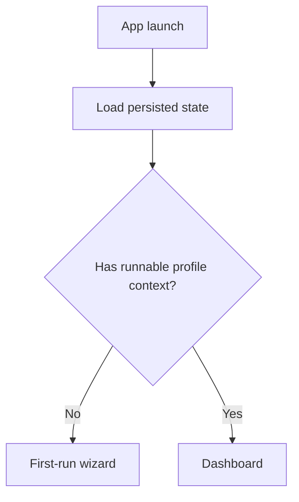
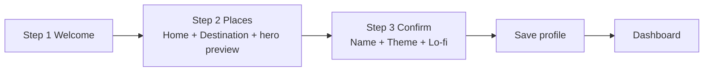
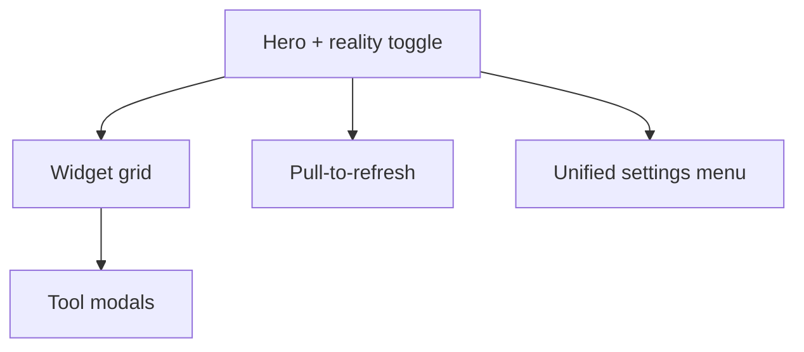
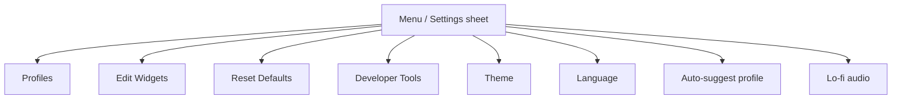

# Unitana — Wireframes (Current Behavior Contracts)

Updated: 2026-02-19

## Metadata
- Owner: Product + Design + Engineering
- Source of truth: Implemented surfaces in `app/unitana/lib/features/dashboard/` and `app/unitana/lib/features/first_run/`
- Last validated against code: 2026-02-19

This is a contract-level wireframe spec aligned to implemented surfaces. It is not pixel art.

## A) Startup routing

## B) First-run / New profile wizard

Wireframe notes:
- Stepper is controlled (not free-swipe onboarding).
- Step 2 shows dual-place context with live preview feedback.
- Step 3 is final commit point and includes profile personalization controls.

## C) Dashboard shell

Wireframe notes:
- Hero always prioritizes home/destination comparability.
- Widget grid supports edit/reorder/add/remove workflows.
- Tools and menu buttons are persistent anchor actions.

## D) Unified settings surface

Wireframe notes:
- Settings is a single consolidated sheet pattern.
- Developer Tools visibility depends on compile-time flag.

## E) Tool modal families

### 1. Converter modal
- Header (tool name + close)
- Input row
- Unit/system row + swap (where applicable)
- Run/convert action
- Result block
- History block

### 2. Matrix/lookup modal
- Header
- Matrix controls (pagination/system slices)
- Table body (reference + value columns)
- Copy-by-cell interaction
- Disclaimer/uncertainty copy where needed (for example clothing)

### 3. Dedicated modal
- Domain-specific cards and controls (for example Weather, Time, Jet Lag, Tip, Tax)
- Same global modal framing and result/history expectations where relevant

## F) Top-6 default tile strip (initial layout)
- Temperature
- Currency
- Baking
- Distance
- Time
- Price Compare

## G) Known visual constraints
- Small-screen readability is first-class for matrix tools.
- Stale/freshness indicators must remain visible without overwhelming primary values.
- Tutorial overlays are currently removed from runtime and are not part of this wireframe baseline.
