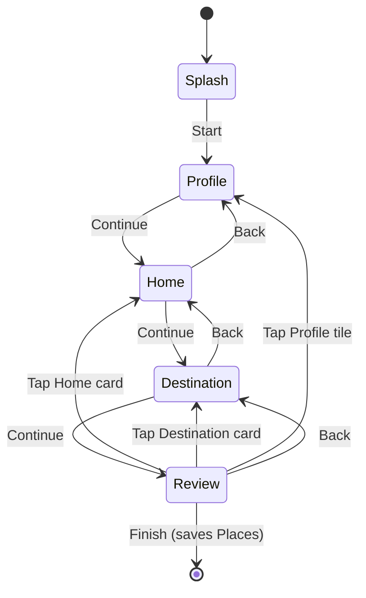
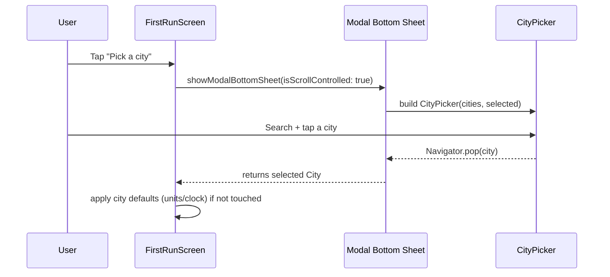

# Unitana - Wireframes (MVP, aligned to code)

This document reflects the current implemented flows in the Flutter repo. It is intentionally concrete so a new contributor can map diagrams to files quickly.

## High-level navigation

```mermaid
flowchart TD
  A[UnitanaApp] --> B{Persisted state loaded?}
  B -->|Loading| C[Startup shell: CircularProgressIndicator]
  B -->|Loaded| D{Onboarded? (defaultPlaceId + places)}
  D -->|No| FR[FirstRunScreen]
  D -->|Yes| DS[DashboardScreen]

  DS -->|Reset| R[UnitanaAppState.resetAll]
  R --> DS2[PushAndRemoveUntil: new UnitanaApp]
  DS2 --> B
```

## First Run Wizard

Implementation: `lib/features/first_run/first_run_screen.dart`

Wizard steps are internal state, not separate routes.



### City selection

City selection is a bottom sheet modal.

Implementation:
- City picker UI: `lib/widgets/city_picker.dart`
- City data loading: `lib/data/city_repository.dart` (JSON asset with curated fallback)



### Review screen layout invariant

On the Review step, each of these should span the available width:
- Profile tile
- Home card
- Destination card

Implementation note: the Review step uses a `Column` with an `Expanded(SingleChildScrollView(...))` so cards remain full width and do not collapse into side-by-side layouts.

## Dashboard

Implementation: `lib/features/dashboard/dashboard_screen.dart`

Current state is a placeholder with a Reset action to re-enter onboarding.

```mermaid
flowchart TD
  DS[DashboardScreen] -->|Reset| R[UnitanaAppState.resetAll]
  R --> N[Navigator.pushAndRemoveUntil(UnitanaApp)]
  N --> FR[FirstRunScreen]
```

## Places and editing flows

Implemented today:
- A single profile name stored alongside Places
- Two Places created by onboarding: `Home` (living) and `Destination` (visiting)

Not implemented yet (intent only, not diagrammed here):
- Place switching sheet
- Place editor screens
- Reordering / deletion rules
