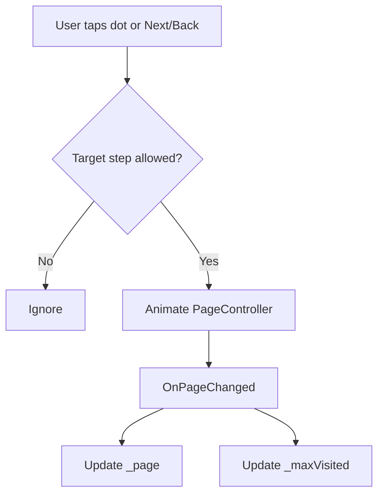

# Architecture: First-run wizard

Primary file: `lib/features/first_run/first_run_screen.dart`

## Goals

- Reduce cognitive load during setup.
- Keep navigation predictable.
- Allow users to edit any step before finishing.

## Flow

## Navigation model

The wizard is implemented as a `PageView` with a controlled `_pageController` and a guarded step jump system.

Key concepts:

- `PageController` owns animated transitions.
- `_page` tracks the current step index.
- `_maxVisited` tracks the furthest step the user has reached.
- `_canGoToStep(target)` enforces:
  - you can always go backward
  - you can jump to any visited step
  - you can go forward by one step at a time

## Review step composition

The review step is intentionally designed to resemble the future dashboard tiles.

- A “My Places” header card (edit entry point)
- Two place cards: Home and Destination
- Each place card is a dense, two-column label/value list

The step is wrapped in a scrollable container to avoid overflow on smaller devices.

## Known improvements

- Split the wizard into smaller widgets/files (see postmortem).
- Add golden tests to catch overflow regressions.
- Move place formatting helpers into a shared utility module so dashboard can reuse them.
